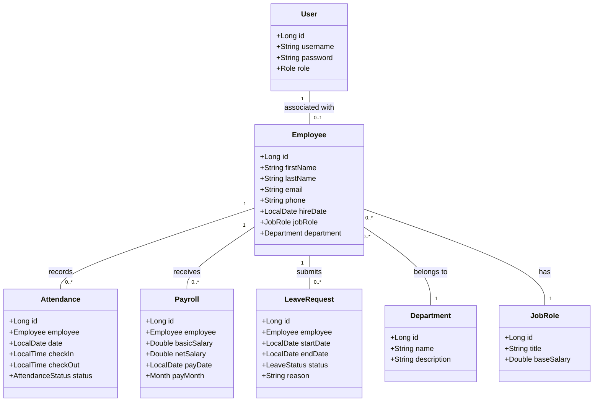
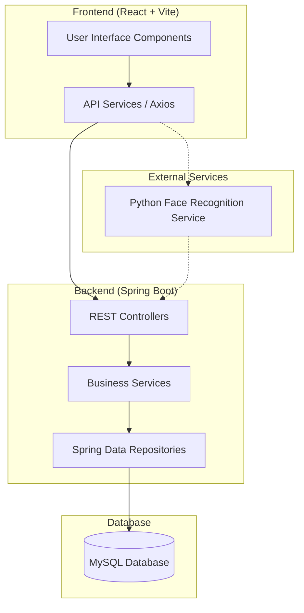
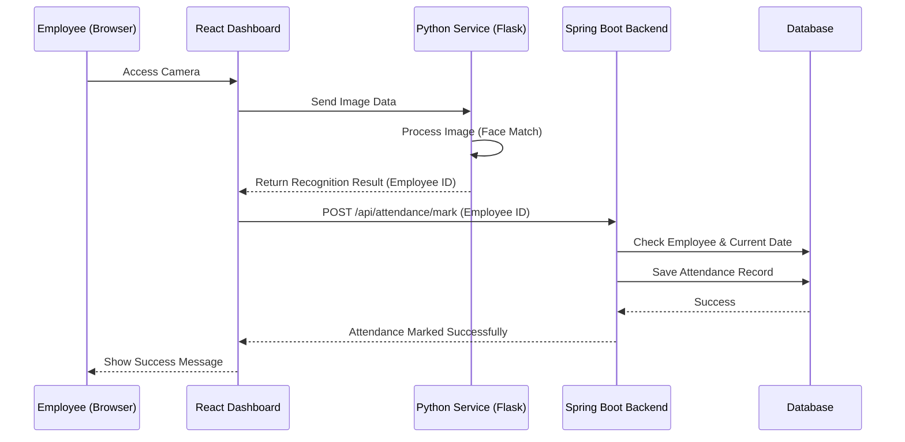
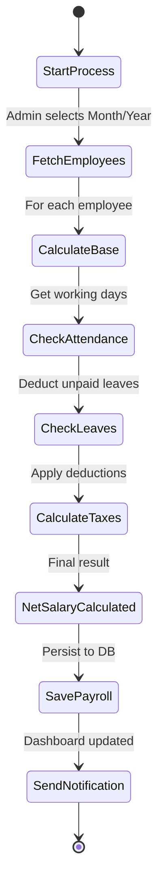
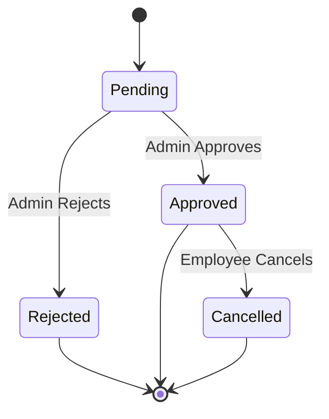
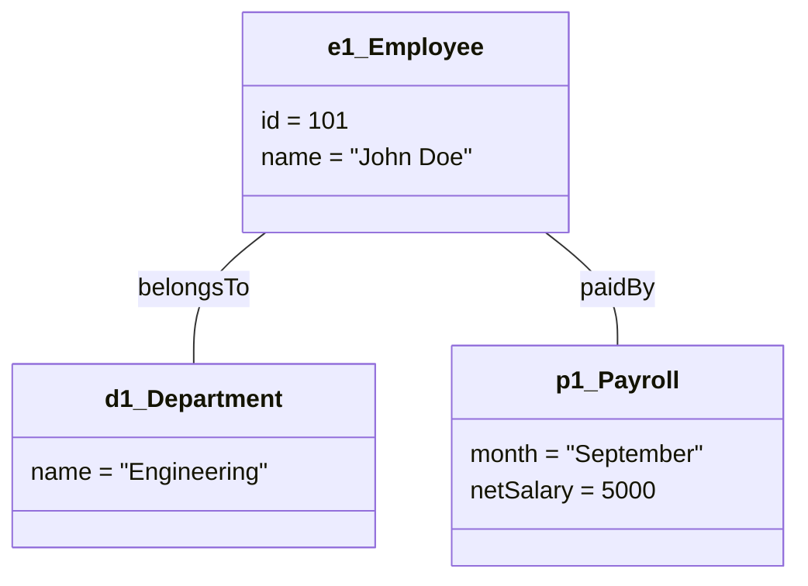
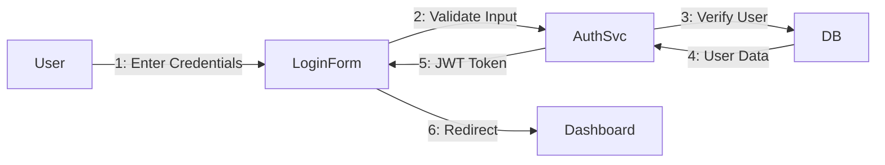

# Payroll Management System - UML Diagrams

This document contains a comprehensive set of UML diagrams representing the architecture and logic of the Payroll Management System.

## 1. Use Case Diagram
Describes the interactions between users (Admin, Employee) and the system.

```mermaid
useCaseDiagram
    actor Admin
    actor Employee
    
    package "Payroll Management System" {
        usecase "Manage Employees" as UC1
        usecase "Generate Payroll" as UC2
        usecase "Manage Departments" as UC3
        usecase "View Personal Dashboard" as UC4
        usecase "Mark Attendance (Face Recognition)" as UC5
        usecase "Request Leave" as UC6
        usecase "View Attendance Reports" as UC7
    }
    
    Admin --> UC1
    Admin --> UC2
    Admin --> UC3
    Admin --> UC7
    
    Employee --> UC4
    Employee --> UC5
    Employee --> UC6
    Employee --> UC7
```

---

## 2. Class Diagram
Represents the static structure of the system and relationships between entities.



---

## 3. Component Diagram
Shows the high-level software components and their dependencies.



---

## 4. Sequence Diagram
Flow: Marking attendance using Face Recognition.



---

## 5. Activity Diagram
Logic for the Monthly Payroll Generation process.



---

## 6. State Diagram
Lifecycle of a Leave Request.



---

## 7. Deployment Diagram
Physical distribution of system artifacts.

```mermaid
deploymentConfig
    node "Client Workstation" {
        browser "Web Browser (Chrome/Firefox)"
    }
    
    node "Application Server" {
        backend "Spring Boot App (.jar)"
        python "Python AI Service"
    }
    
    node "Database Server" {
        database "MySQL Server"
    }
    
    browser -- backend : HTTP/JSON
    backend -- python : REST API
    backend -- database : JDBC
```

---

## 8. Object Diagram
A snapshot of the system state with specific instances.



---

## 9. Collaboration Diagram
Object interaction focus for the Login process.


